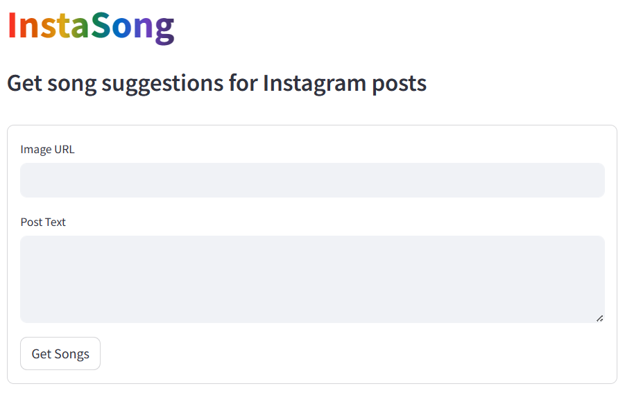

# InstaSong

InstaSong is an application designed to be integrated with social networks to help users choose the perfect song for their posts.

## Use

The user inputs the image URL with or without the text for the post, and InstaSong will suggest songs that can harmonize with the post.

### Interface

Our simple and intuitive interface was made with [Streamlit](https://streamlit.io/)



## Behind the application

InstaSong can be thought as a combination of steps:

-   User input
-   Song verse generation from image:
    -   Generate text using a Transformer pre-trained model from Hugging Face: [Salesforce/blip-image-captioning-base](https://huggingface.co/Salesforce/blip-image-captioning-base)
    -   Generate a song verse based on the output using [Co.Generate](https://docs.cohere.com/reference/generate)
-   Embed the text generated in [our dataset](###Our-dataset) with [Co.Embed](https://docs.cohere.com/reference/embed)
-   Extract the songs with the greatest similarity
-   Display the results

We generate different results from the image and the text post, and take the ones with highest similarity.

### Our dataset

We combined two datasets: [Spotify Million Song Dataset](https://www.kaggle.com/datasets/notshrirang/spotify-million-song-dataset) and [🎹 Spotify Tracks Dataset](https://www.kaggle.com/datasets/maharshipandya/-spotify-tracks-dataset) to get songs lyrics and popularity on spotify. The code to achieve this is in the [notebook](notebook.ipynb).

## Prerequisites

To run the app locally it is necessary to have `Python` and `pip` installed.

To install all dependencies, run

```
pip install -r requirements.txt
```

### API Keys

It is necessary to have keys for [Spotify Web API](https://developer.spotify.com/documentation/web-api) and [Cohere API](https://docs.cohere.com/reference/about).

To run only the app, a free key is fine. But to run the embed in the [notebook](notebook.ipynb) and make changes to the model, a [Production Key](https://cohere.com/pricing) for the Cohere API will be required.

The files `./.streamlit/secrets.toml` and `./.env` containing the following (without brackets) are required:

```
SPOTIFY_CLIENT_ID = "[YOUR_KEY_HERE]"
SPOTIFY_CLIENT_SECRET = "[YOUR_KEY_HERE]"

COHERE_API_KEY = "[YOUR_KEY_HERE]"
```

## Execute

To execute InstaSong, run

```
streamlit run app.py
```

The application should be running on [Port 8501](http://localhost:8501)

## Limitations

Our model finds a song lyrics that fit a given text. It works great for the post text, but it could be a more precise aproach to use information about the vibe and feeling of the image and the music, instead of generating a song verse from the image and finding a match.
